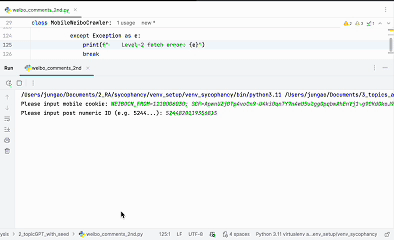
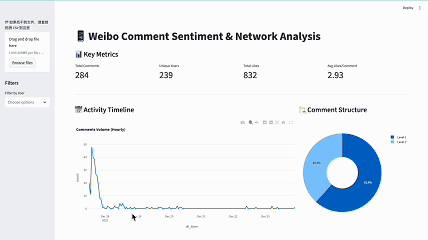

# 🕷️ Weibo Comment & Sentiment Crawler

> **⚠️ Confidential Research Project**
> This repository serves as a demonstration for an ongoing academic research project. Due to the sensitive information involved, the **source code is currently confidential** and cannot be publicly released.
> 
> However, the demo below illustrates the full pipeline, UI interaction, and analytical capabilities of the system.

<p align="center">
  
</p>

<br>

<p align="center">
  
</p>

A robust, two-stage Python crawler designed to scrape Weibo posts, detailed metadata, and hierarchical comments (including "reply-to-reply" threads) based on specific keywords.

Designed for **Data Analysis**, **Sentiment Analysis**, and **Public Opinion Monitoring**.

## Key Features

* **Dual Mode Architecture:**
* **Mode 1 (Search):** Scrapes `s.weibo.com` to find relevant post IDs based on keywords.
* **Mode 2 (Deep Crawl):** Uses the internal Weibo API (`weibo.com/ajax`) to fetch post details and all comments.


* **Incremental Crawling:** Automatically checks existing CSV files to skip already scraped posts. You can stop and resume the script at any time.
* **Data Cleaning:** Automatically strips HTML tags, formats timestamps, and normalizes IP locations.
* **Safety Mechanisms:**
* Random sleep intervals to mimic human behavior.
* "Circuit Breaker": Automatically stops if the Cookie expires or if consecutive failures occur.


* **Excel Ready:** Outputs to `.csv` with `utf-8-sig` encoding, ensuring emojis and Chinese characters display correctly in Excel.

## Prerequisites

* Python 3.8+
* A valid Weibo account (to generate a Cookie).

### Installation

Install the required Python libraries:

```bash
pip install requests pandas beautifulsoup4

```

## Usage Guide

### Step 1: Get Your Weibo Cookie

This script requires a login Cookie to bypass Weibo's login wall.

1. Log in to [weibo.com](https://weibo.com) in your browser (Chrome/Edge recommended).
2. Press `F12` to open Developer Tools.
3. Go to the **Network** tab.
4. Refresh the page.
5. Click on any request (e.g., `home` or `config`).
6. Scroll down to **Request Headers**, find **Cookie**, and copy the entire string value.

### Step 2: Configure Keywords (Optional)

Open the script and find the `KEYWORDS` list at the top. Modify it to track your topics of interest:

```python
KEYWORDS = [
    "生育补贴", 
]

```

### Step 3: Run the Script

Run the script in your terminal:

```bash
python weibo_crawler.py

```

### Step 4: Select Mode

When prompted, input your Cookie, then select a mode:

* **[1] Search Posts:** Scrapes search results to get Post IDs. Saves to `crawler_results/2025_posts_list.csv`.
* **[2] Crawl Comments:** Reads the Post IDs from Step 1 and fetches comments. Saves to `crawler_results/2025_comments_detailed_final.csv`.
* **[3] Full Process:** Runs Step 1 followed immediately by Step 2.

## 📂 Output Data Structure

The final output is saved in `crawler_results/2025_comments_detailed_final.csv`.

| Column | Description |
| --- | --- |
| **keyword** | The search term that found this post. |
| **post_id** | The unique numeric ID of the Weibo post. |
| **post_date** | Date the post was published (YYYY-MM-DD). |
| **post_ip** | Location/Region of the original poster. |
| **post_tool** | Device used (e.g., "iPhone 15 Pro", "Android"). |
| **post_repost_count** | Number of shares. |
| **post_comment_count** | Total number of comments. |
| **post_like_count** | Number of likes on the post. |
| **comment_user_name** | Username of the commenter. |
| **comment_content** | **The actual text of the comment.** |
| **parent_comment_id** | If empty, it's a root comment. If filled, it's a reply to another comment. |
| **comment_like_count** | Number of likes on the specific comment. |

## ⚠️ Important Notes

1. **Cookie Expiry:** Weibo cookies usually last 12-24 hours. If the script prints `COOKIE_EXPIRED` or "Cookie失效", repeat **Step 1** to get a new one.
2. **Rate Limiting:** Do not set the sleep timers (`time.sleep`) too low. Weibo is aggressive against fast crawlers.
3. **Data Privacy:** This tool is for research/educational purposes. Please respect user privacy and Weibo's Terms of Service.
